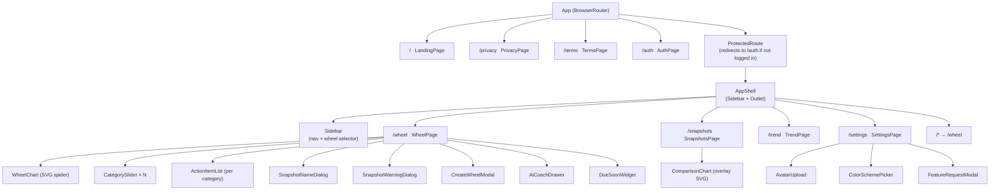

# App Routing & Component Tree

```mermaid
graph TD
    App["App (BrowserRouter)"]

    App --> Landing["/ &nbsp; LandingPage"]
    App --> Privacy["/privacy &nbsp; PrivacyPage"]
    App --> Terms["/terms &nbsp; TermsPage"]
    App --> Auth["/auth &nbsp; AuthPage"]
    App --> Protected["ProtectedRoute\n(redirects to /auth if not logged in)"]

    Protected --> Shell["AppShell\n(Sidebar + Outlet)"]

    Shell --> Sidebar["Sidebar\n(nav + wheel selector)"]
    Shell --> Wheel["/wheel &nbsp; WheelPage"]
    Shell --> Snapshots["/snapshots &nbsp; SnapshotsPage"]
    Shell --> Trend["/trend &nbsp; TrendPage"]
    Shell --> Settings["/settings &nbsp; SettingsPage"]
    Shell --> Catch["/* → /wheel"]

    Wheel --> WheelChart["WheelChart (SVG spider)"]
    Wheel --> CategorySlider["CategorySlider × N"]
    Wheel --> ActionItemList["ActionItemList (per category)"]
    Wheel --> SnapshotNameDialog["SnapshotNameDialog"]
    Wheel --> SnapshotWarningDialog["SnapshotWarningDialog"]
    Wheel --> CreateWheelModal["CreateWheelModal"]
    Wheel --> AiCoachDrawer["AiCoachDrawer"]
    Wheel --> DueSoonWidget["DueSoonWidget"]

    Snapshots --> ComparisonChart["ComparisonChart (overlay SVG)"]

    Settings --> AvatarUpload["AvatarUpload"]
    Settings --> ColorSchemePicker["ColorSchemePicker"]
    Settings --> FeatureRequestModal["FeatureRequestModal"]
```
