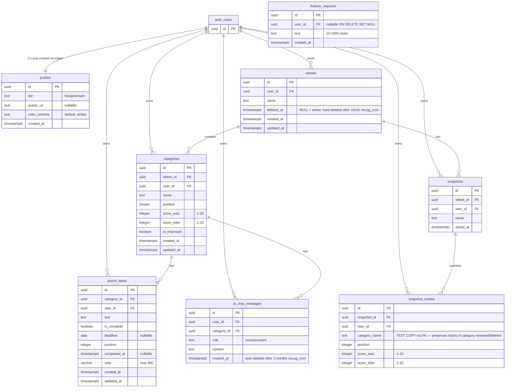

# Database Schema

## RLS Summary

Every table has RLS enabled. Pattern: `user_id = auth.uid()` on SELECT/INSERT/UPDATE/DELETE.

- `snapshot_scores` — insert only; immutable once written (delete cascades from snapshot).
- `snapshots` — no UPDATE (name is immutable in v1).
- `feature_requests` — insert only for users; founder reads via service role.
- `wheels` — free-tier INSERT blocked by `count_user_wheels()` SECURITY DEFINER function (prevents RLS recursion).
- `storage.objects` (avatars bucket) — public read, authenticated write to own folder.
