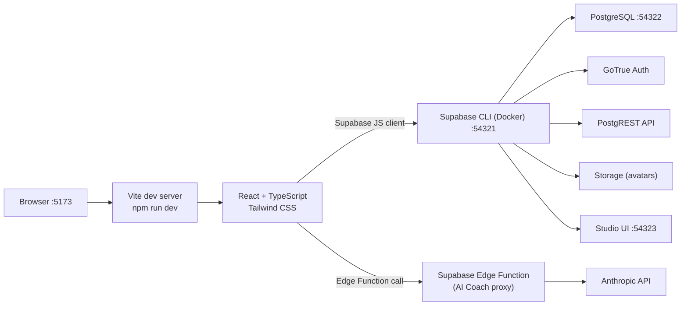

# Local Dev Environment

## Ports

| Service | Local URL |
|---|---|
| Frontend | http://localhost:5173 |
| Supabase API | http://localhost:54321 |
| PostgreSQL | localhost:54322 |
| Studio | http://localhost:54323 |
