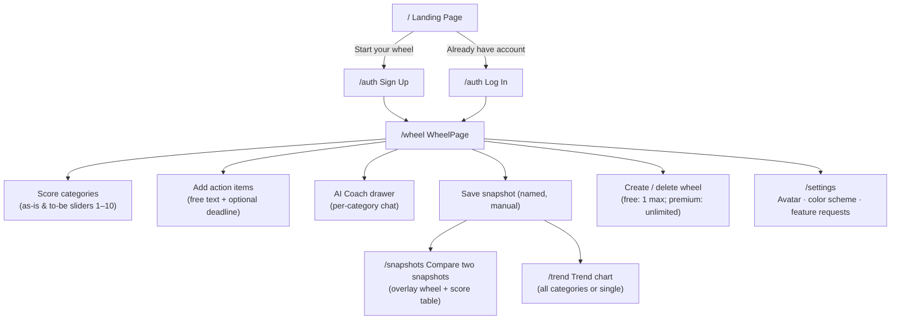

# User Flow

```mermaid
flowchart TD
    Visit["/ Landing Page"] -->|"Start your wheel"| Signup["/auth Sign Up"]
    Visit -->|"Already have account"| Login["/auth Log In"]
    Signup --> WheelPage
    Login --> WheelPage

    WheelPage["/wheel WheelPage"] --> Score["Score categories\n(as-is & to-be sliders 1–10)"]
    WheelPage --> AddActions["Add action items\n(free text + optional deadline)"]
    WheelPage --> AiCoach["AI Coach drawer\n(per-category chat)"]
    WheelPage --> SaveSnap["Save snapshot (named, manual)"]
    WheelPage --> ManageWheels["Create / delete wheel\n(free: 1 max; premium: unlimited)"]

    SaveSnap --> Compare["/snapshots Compare two snapshots\n(overlay wheel + score table)"]
    SaveSnap --> Chart["/trend Trend chart\n(all categories or single)"]

    WheelPage --> Settings["/settings\nAvatar · color scheme · feature requests"]
```
